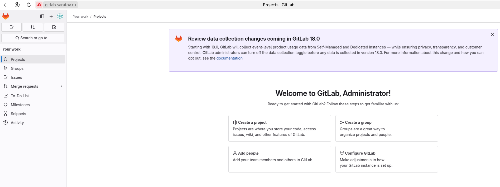
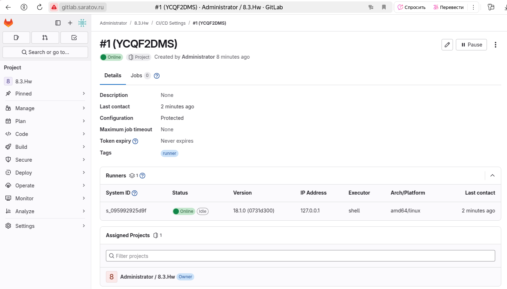
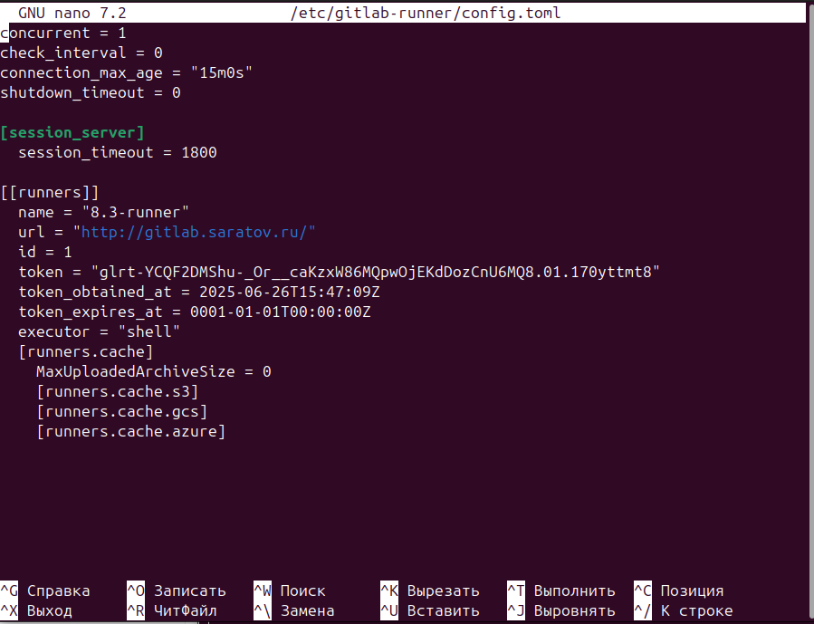
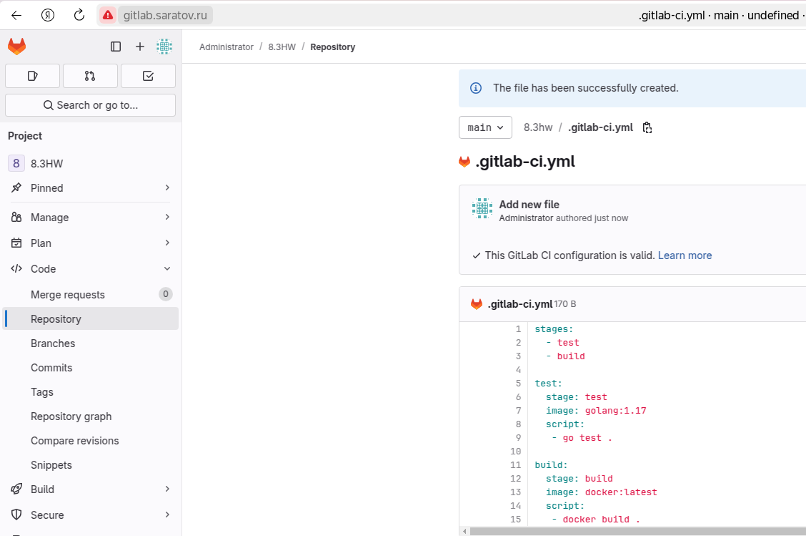

# Домашнее задание к занятию "`GitLab`" - `Толмачев Алексей`

### Задание 1
  1. Разверните GitLab локально, используя Vagrantfile и инструкцию, описанные в этом репозитории.
  2. Создайте новый проект и пустой репозиторий в нём.
  3. Зарегистрируйте gitlab-runner для этого проекта и запустите его в режиме Docker. Раннер можно регистрировать и запускать на той же виртуальной машине, на которой запущен GitLab.

#### Решение
`Развернул локально gitlab`

`

`Запустил Runner`
`

`Конфиг Runner`
`

---

### Задание 2
  1. Запушьте репозиторий на GitLab, изменив origin. Это изучалось на занятии по Git.
  2. Создайте .gitlab-ci.yml, описав в нём все необходимые, на ваш взгляд, этапы.

#### Решение
Приведите ответ в свободной форме...

`При необходимости прикрепитe сюда скриншоты`

`Показ commit-а`
`

